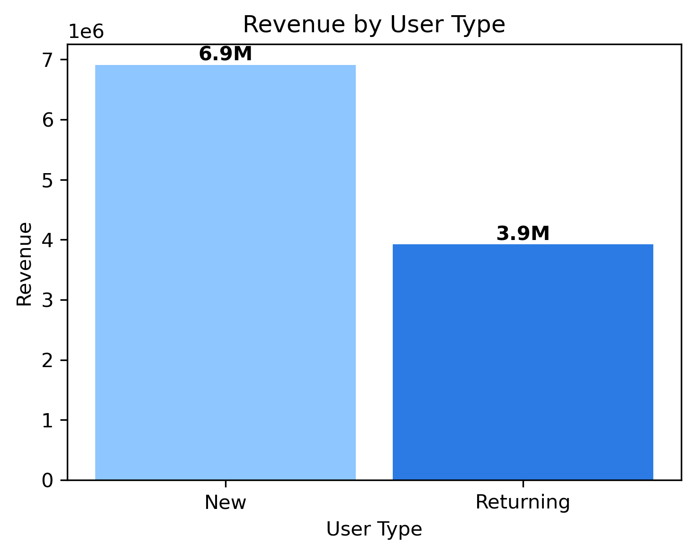
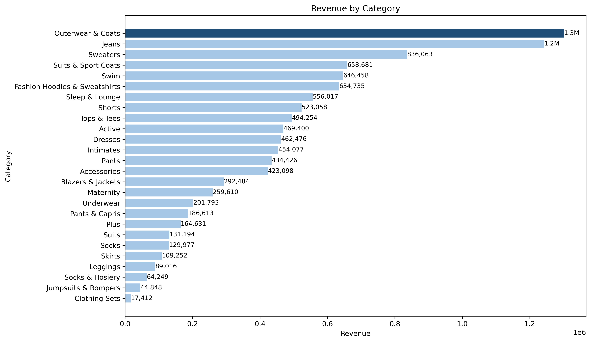

# SQL E-commerce Revenue Analysis

This project analyzes user purchase behavior and revenue patterns using BigQuery's public `thelook_ecommerce` dataset.

SQL queries were written in BigQuery to extract pre-aggregated results, which are then loaded into a Jupyter notebook for visualization and interpretation.

---

## Project Structure

```
sql-ecommerce-revenue-analysis/
│
├── README.md
├── notebook/
│   └── sql_ecommerce_revenue_analysis.ipynb
│
├── sql/
│   ├── 01_new_vs_returning.sql
│   ├── 02_category_analysis.sql
│   └── 03_price_analysis.sql
│
└── images/
    ├── revenue_by_user_type.png
    ├── order_volume_by_user_type.png
    ├── revenue_by_category.png
    ├── order_volume_by_category.png
    ├── revenue_by_price_segment.png
    └── order_volume_by_price_segment.png
```

---

## Analysis

### 1. New vs Returning Users

**Objective**

To compare revenue contribution and purchasing behavior between new and returning users.

**Key Findings**

- New users (80,106) generated higher total revenue (6.9M) due to a significantly larger user base.
- Returning users (29,970) placed 45,165 orders — averaging 1.51 orders per user, compared to 1.00 for new users.
- Average price per item remained nearly identical: 59.45 USD (New) vs 59.75 USD (Returning).

**Insight**

Revenue differences between new and returning users are not driven by spending per transaction, but by purchase frequency. Returning users spend a similar amount per transaction — they simply return more often, resulting in higher cumulative contribution over time.

**Additional Observation**

When filtering to a 3-month window, results appeared heavily skewed toward new users, suggesting that early-stage data can overrepresent new user activity.

Expanding to the full dataset revealed a more balanced pattern, with returning users contributing significantly more to revenue over time.

This highlights the importance of selecting an appropriate analysis window when interpreting user behavior.

---

### 2. Category Analysis

**Objective**

To identify which product categories drive revenue and how purchasing behavior differs across categories.

**Key Findings**

- Outerwear & Coats generated the highest revenue (1.3M USD) with only 9,017 purchases.
- Intimates recorded the highest purchase volume (13,586) but produced only 454K USD in revenue.
- Jeans ranked second in revenue (1.2M USD) while maintaining strong purchase volume (12,774), acting as a core balanced category.
- Suits showed a high average price (117 USD) but low purchase volume (1,121), indicating potential for revenue growth.

**Insight**

Revenue performance is structurally driven by transaction value and purchase frequency, rather than purchase volume alone. The contrast between Outerwear and Intimates clearly demonstrates that price plays a more significant role than quantity.

The product structure naturally segments into three groups: high-value categories such as Outerwear & Coats, balanced categories such as Jeans, and volume-driven categories such as Intimates and Swim. This indicates that category performance is not uniform, and each category operates under a different revenue mechanism.

---

### 3. Price Analysis

**Objective**

To analyze how different price segments influence purchasing behavior and revenue.

**Key Findings**

- High-priced items generated 5.6M USD in revenue from 36,790 purchases (avg 152.89 USD).
- Mid-priced items generated 3.9M USD from 77,772 purchases (avg 50.32 USD).
- Low-priced items generated 1.3M USD from 67,258 purchases (avg 19.19 USD).

**Insight**

The pricing structure reinforces a clear pattern: fewer high-priced transactions generate significantly more revenue than a larger number of low-priced purchases.

While low-priced items contribute to higher purchase volume, revenue is disproportionately driven by high-priced products. This indicates that revenue is more sensitive to price than to transaction volume — increasing transaction value is more impactful than increasing the number of transactions.

---

## Key Takeaway

Across all analyses, one consistent principle emerges: revenue is driven by price and purchase frequency — not volume alone.

This is supported by three consistent patterns across the data:
- Returning users purchase 1.51x more frequently than new users
- Outerwear with 9K purchases generates 3x more revenue than Intimates with 13K purchases
- High-priced items produce significantly higher revenue despite fewer transactions

---

## Business Implications

The analysis suggests that optimizing for transaction volume alone is insufficient. Effective revenue growth requires a combined focus on user retention and high-value pricing strategy.

Returning users demonstrate stronger engagement through repeated purchases, while revenue is disproportionately driven by high-priced items. Together, these findings suggest that encouraging high-value purchases among returning users may represent the most impactful growth lever.

Strategies focused solely on increasing transaction volume may be less effective than those targeting high-value users and purchases.

---

## Tools & Dataset

- **Query**: BigQuery (Google Cloud)
- **Dataset**: `bigquery-public-data.thelook_ecommerce`
- **Visualization**: Python (pandas, matplotlib)
