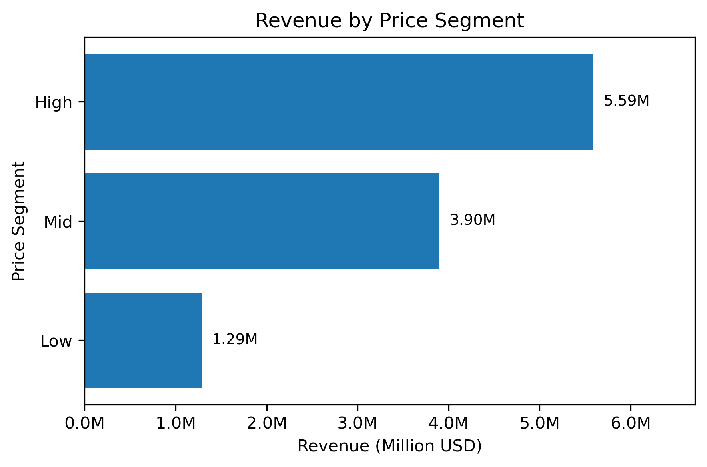

# SQL E-commerce Revenue Analysis

This project analyzes user purchase behavior and revenue patterns using BigQuery's public `thelook_ecommerce` dataset.

SQL queries were written in BigQuery to extract pre-aggregated results, which are then loaded into a Jupyter notebook for visualization and interpretation.

---
## Business Problem

E-commerce platforms often struggle to understand what truly drives revenue: 
Is it the number of purchases, the price of items, or user behavior?

This analysis aims to identify the key drivers of revenue and uncover actionable strategies for growth.  

---

## Project Structure

```
sql-ecommerce-revenue-analysis/
│
├── README.md
├── notebook/
│   └── sql_ecommerce_revenue_analysis.ipynb
│
├── sql/
│   ├── 01_new_vs_returning.sql
│   ├── 02_category_analysis.sql
│   └── 03_price_analysis.sql
│
└── images/
    ├── revenue_by_user_type.png
    ├── order_volume_by_user_type.png
    ├── revenue_by_category.png
    ├── order_volume_by_category.png
    ├── revenue_by_price_segment.png
    └── order_volume_by_price_segment.png
```

---

## Analysis

### 1. First-order vs Repeat-order Behavior

**Objective**

Compare completed first orders with subsequent completed repeat orders for the same users.

**Key Findings**
- 27,511 users generated at least one completed order.
- 3,316 users generated repeat-order activity, producing 3,655 repeat orders.
- First orders had an average order value of about 86.49 USD, while repeat orders averaged about 88.16 USD.
- Average items per order were similar: about 1.45 for first orders vs 1.47 for repeat orders.
- Average item prices were nearly identical at about 59.67 USD vs 60.05 USD.

**Insight**

Repeat-order activity exists, but repeat orders are not structurally much larger or more expensive than first orders. The main difference is the occurrence of additional purchase activity rather than a major change in basket value.

**Scope Note**

Only orders with `status = 'Complete'` are included. The share of users with repeat orders should not be interpreted as a retention rate because users may have different observation windows.

---

### 2. Category Analysis

**Objective**

Compare gross sales, item volume, order coverage, and average item price across product categories using completed orders only.

**Key Findings**
- Outerwear & Coats generated the highest gross sales (~337K USD) from 2,269 items across 2,219 orders, with an average item price of about 148.72 USD.
- Jeans generated the second-highest gross sales (~308K USD) from 3,203 items across 3,085 orders, with an average item price of about 96.09 USD.
- Intimates recorded the highest item volume (3,323 items) across 3,110 orders but generated about 109K USD in gross sales, with a much lower average item price of about 32.83 USD.

**Insight**

Category revenue reflects the combination of item volume and average item price rather than volume alone. High-volume categories do not necessarily generate the highest gross sales when their average item price is substantially lower.

**Scope Note**

Only orders with `status = 'Complete'` are included. Category-level `order_count` values are not additive across categories because a single order can contain items from multiple categories.

---

### 3. Price Analysis

**Objective**

To analyze how different price segments influence purchasing behavior and revenue.

**Key Findings**
- High-priced items generated 5.6M USD in revenue from 36,790 purchases (avg 152.89 USD).
- Mid-priced items generated 3.9M USD from 77,772 purchases (avg 50.32 USD).
- Low-priced items generated 1.3M USD from 67,258 purchases (avg 19.19 USD).


**Insight**

The pricing structure reinforces a clear pattern: fewer high-priced transactions generate significantly more revenue than a larger number of low-priced purchases.

While low-priced items contribute to higher purchase volume, revenue is disproportionately driven by high-priced products. This indicates that revenue is more sensitive to price than to transaction volume — increasing transaction value is more impactful than increasing the number of transactions.

---

## Key Takeaway

Across all analyses, one consistent principle emerges: revenue is driven by price and purchase frequency — not volume alone.

This is supported by three consistent patterns across the data:
- Returning users purchase 1.51x more frequently than new users
- Outerwear with 9K purchases generates 3x more revenue than Intimates with 13K purchases
- High-priced items produce significantly higher revenue despite fewer transactions

---

## Business Implications

The analysis suggests that optimizing for transaction volume alone is insufficient. Effective revenue growth requires a combined focus on user retention and high-value pricing strategy.

Returning users demonstrate stronger engagement through repeated purchases, while revenue is disproportionately driven by high-priced items. Together, these findings suggest that encouraging high-value purchases among returning users may represent the most impactful growth lever.

Strategies focused solely on increasing transaction volume may be less effective than those targeting high-value users and purchases.

---

## Tools & Dataset

- **Query**: BigQuery (Google Cloud)
- **Dataset**: `bigquery-public-data.thelook_ecommerce`
- **Visualization**: Python (pandas, matplotlib)
